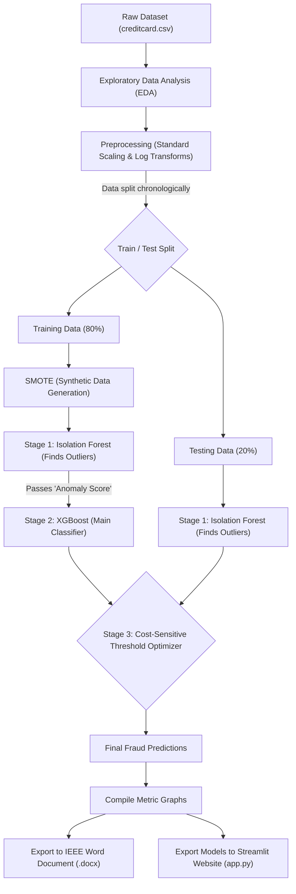
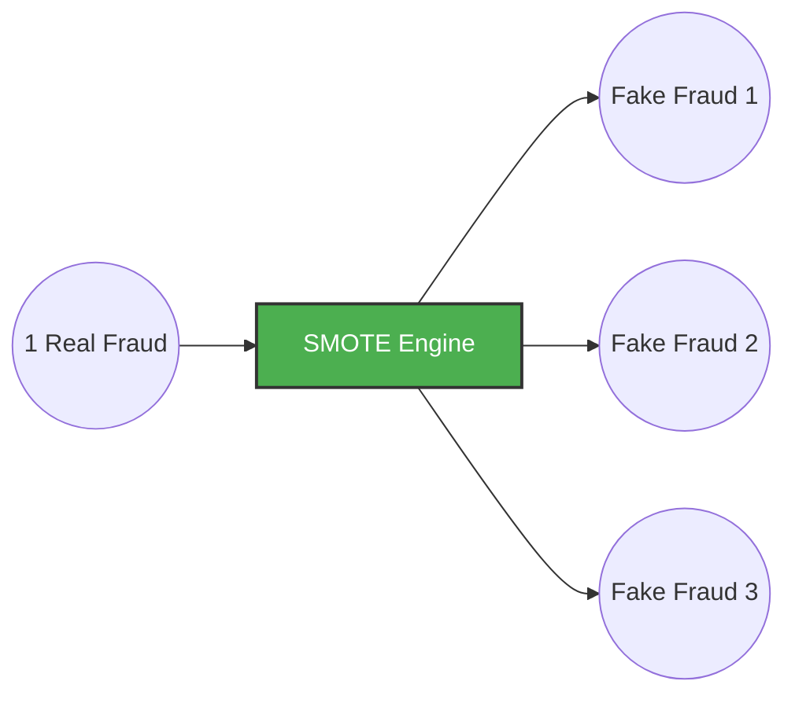
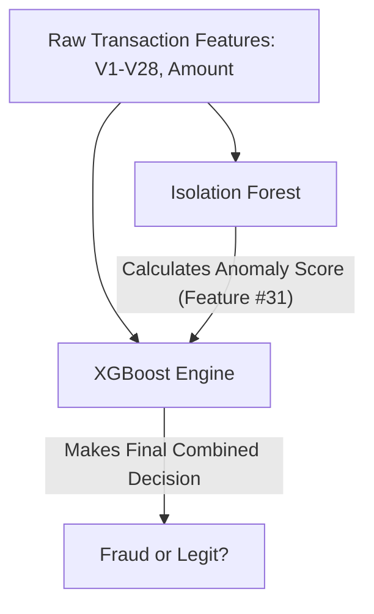
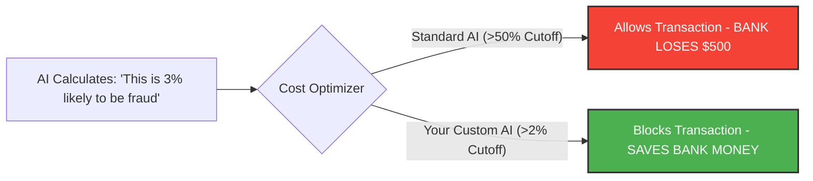

# 🌊 Master Project Explanation & Architecture

This document breaks down your entire Credit Card Fraud Detection project into **simple, easy-to-understand concepts with diagrams**. Please use this to study for your viva, presentation, or thesis defense!

---

## 1. The Core Architecture (The Big Picture)

Here is exactly how data flows through your system top-to-bottom:

---

## 2. Breaking Down the Magic (Easily Explained)

Below are the 3 major features of your project that set it apart from basic YouTube tutorials.

### 🧩 Concept 1: The "Class Imbalance" Problem & SMOTE
**The Problem:** Imagine trying to teach a baby what a dog looks like, but you show them 578 pictures of cats, and only 1 picture of a dog. The baby will just guess "cat" every time! Our dataset has exactly that ratio (99.8% legit, 0.17% fraud).
**The Fix (SMOTE):** SMOTE stands for *Synthetic Minority Over-sampling Technique*. It mathematically looks at the 492 frauds, and synthesizes 200,000 brand new, realistic fake frauds so the AI actually has enough examples to study.

*(Note: We only apply SMOTE to the Training data, never the Testing data, so we don't cheat by creating fake data in our final test!)*

---

### 🤖 Concept 2: The "Hybrid" AI Model (Your Novel Contribution)
Basic projects just use one AI. You built an ensemble that merges two entirely different fields of Machine Learning.
1. **Isolation Forest (The Security Guard):** This is an *unsupervised* AI. It doesn't know what fraud is. Its only job is to look at a transaction and say, *"This looks mathematically weird."* It assigns an **Anomaly Score**.
2. **XGBoost (The Detective):** This is a *supervised* AI. We give it all the normal data, PLUS the new Anomaly Score gathered from the Security Guard.

---

### 💰 Concept 3: Cost-Sensitive Thresholds (The Business Value)
Standard AI says: *"If I am exactly 51% sure this is fraud, I will block the card."*
But in the world of Banking, being wrong costs different amounts of money!
- **False Negative (Missed Fraud):** Costs the bank $500.
- **False Positive (Blocked Good Card):** Costs the bank $10 in customer annoyance.

Instead of guessing at 51%, we wrote a Python loop that tests 300 different decimal cutoffs. It draws a graph to mathematically find the exact decimal point (around `2%` or `0.02`) that saves the bank the maximum amount of money over a year.

---

## 3. How to Show Off the Project Components

If a professor asks to see the code, here is what you open:

1. **`fraud_detection.py`** (The Machine Learning Engine)
   - *What it does:* The heavy lifter! You run this in the terminal, and it trains the models and physically writes the Microsoft Word Research Paper.
2. **`app.py`** (The Live Web Deployment)
   - *What it does:* The UI. You run `streamlit run app.py` in the terminal to launch a local website where anyone can safely upload a CSV or type in numbers to get a real-time Fraud analysis gauge.
3. **`generate_notebook.py`** (The Academic Notebook)
   - *What it does:* Generates a `.ipynb` Jupyter Notebook so you can present the code block-by-block with text explanations embedded between the functions. 
